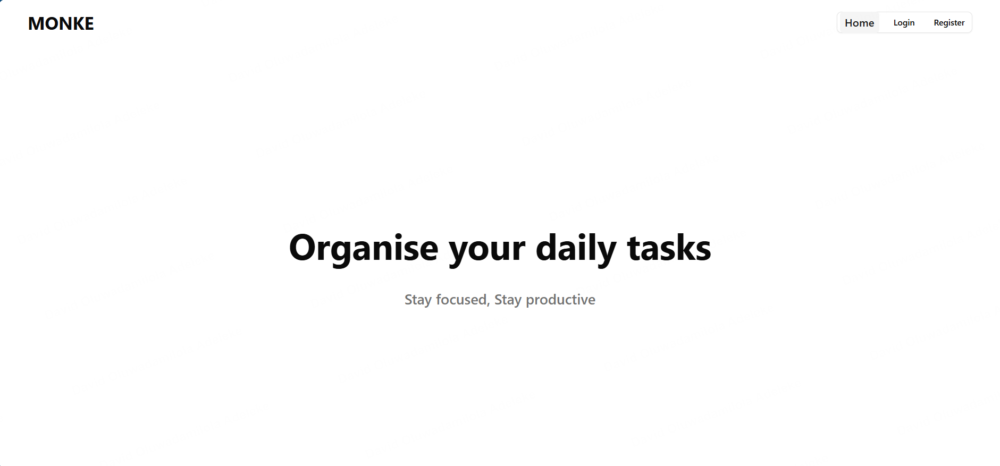
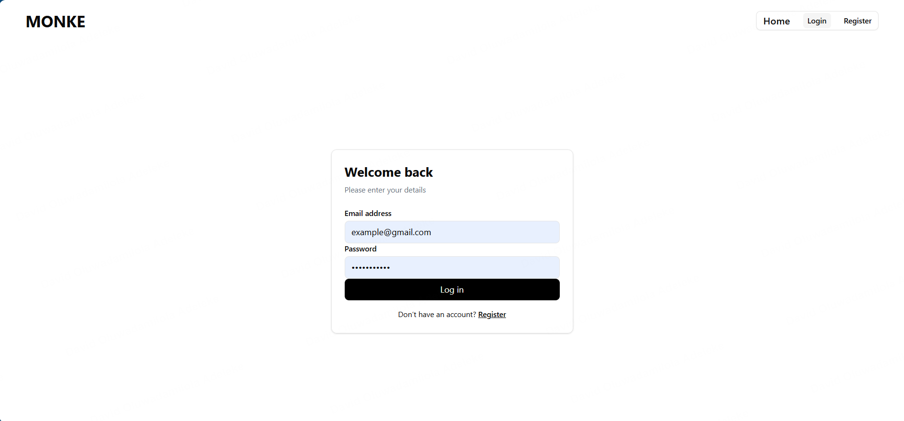
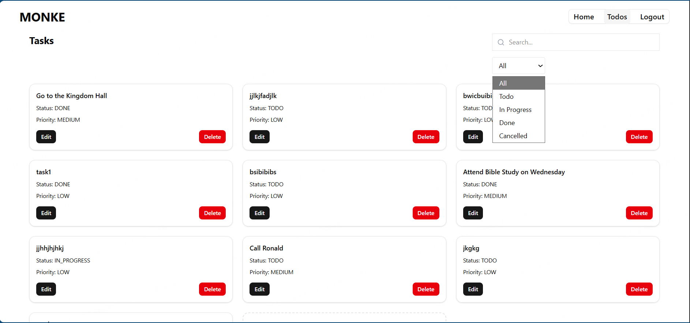
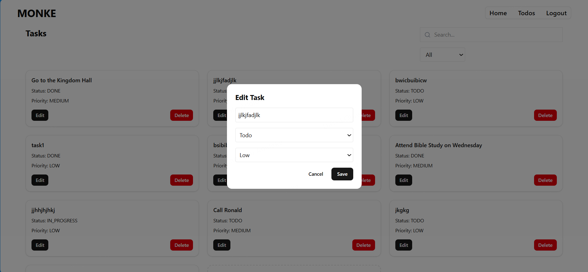
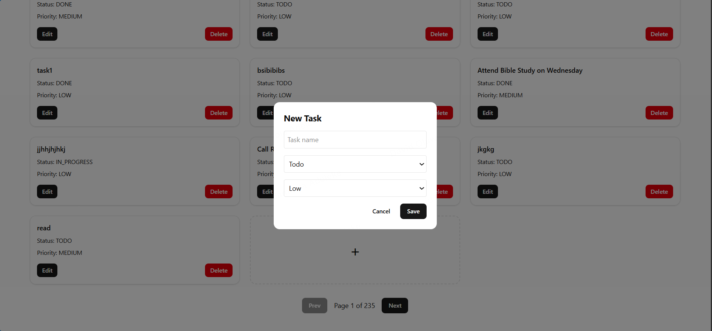

# Todo App

## Project Overview

This project is a Todo App built with React and Vite. It allows users to manage tasks efficiently by providing the ability to create, edit, delete, and view detailed information for each task. Users can filter tasks by status, search by name, and navigate through paginated lists. The app is fully responsive and optimized for mobile, tablet, and desktop screens.

The frontend uses a modern stack with Vite for fast development, React for a component-based architecture, Tailwind CSS for styling, and shadcn UI components for consistent, accessible UI elements. State management is handled locally within components, with `react-hook-form` used for form management and validation. Routes are handled with `react-router-dom`, including protected routes for authentication.

---

## Features

- Add new tasks with name, status, priority, and description  
- Edit existing tasks with pre-filled forms  
- Delete tasks with confirmation  
- View task details with timestamps for creation and updates  
- Search and filter tasks by status  
- Pagination for efficient handling of large task lists  
- Responsive UI across devices  
- Protected routes requiring authentication  

---

## Setup Instructions

1. Clone the repository:

```bash
git clone https://github.com/David-Adeleke/ToDo.git
cd todo-app
```

2. Install dependencies:
```bash
npm install
```

3. Start the development server:
```bash
npm run dev
```

4. Open http://localhost:5173 in your browser.

## Available Scripts

```bash 
npm run dev
```
– Starts the Vite development server

```bash 
npm run build
```
– Builds the project for production

```bash 
npm run preview
```
– Previews the production build locally

```bash
npm run lint
```
– Runs ESLint to check code quality

## Technology Choices

- Vite – Fast, modern build tool optimized for React projects

- React – Component-based library for building the frontend

- React Router DOM – Handles routing and nested routes

- Tailwind CSS – Utility-first styling for rapid UI development

- Shadcn UI – Provides accessible, prebuilt UI components

- React Hook Form – Simplifies form handling and validation

- Axios – HTTP client for API requests

- Tailwind Merge – Manage conditional class names and variant styling

- Lucide React – Icon library for lightweight and scalable SVG icons

## Screenshots











# Reasoning:
This stack provides a balance of speed, simplicity, and maintainability. Vite ensures fast development builds, while Tailwind CSS and shadcn allow rapid creation of responsive, accessible UIs. React Hook Form makes handling forms simple and reduces boilerplate. Overall, the stack keeps the project modular, scalable, and easy to extend.

## Known Issues and Future Improvements
- Dark mode toggle could be implemented for better usability in low-light environments.
